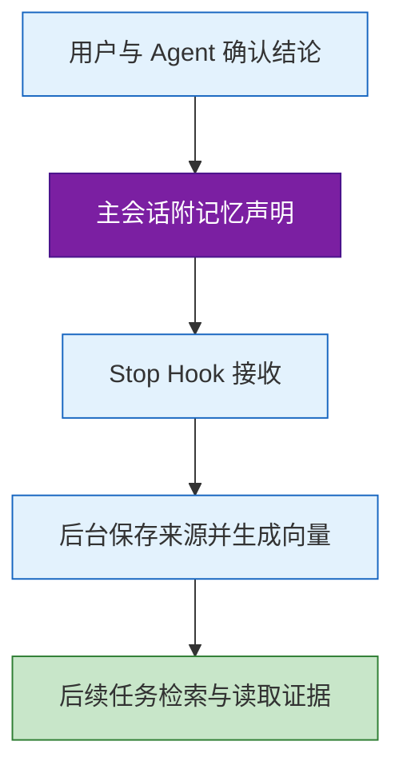

# JTH 使用指南：从项目初始化到日常任务与记忆管理

- **适用读者**：会使用终端和 Codex，第一次接触 JTH 的开发者。
- **核对日期**：2026-09-22。
- **实现基准**：jt-harness 仓库提交 `f7410a2`；本文涉及的增强记忆读取属于该提交对应的构建。
- **使用环境**：命令示例采用 macOS / Linux Shell，宿主使用支持项目 Hooks 的 Codex。

---

## 目录

- [一、先把一个项目接进来](#一先把一个项目接进来)
- [二、准备环境并安装工具](#二准备环境并安装工具)
- [三、初始化项目和记忆库](#三初始化项目和记忆库)
- [四、在 Codex 中完成一次任务](#四在-codex-中完成一次任务)
- [五、让确认过的结论留下来](#五让确认过的结论留下来)
- [六、查找记忆并展开证据](#六查找记忆并展开证据)
- [七、查看采用记录与处理失败](#七查看采用记录与处理失败)
- [八、接入第二个项目和升级](#八接入第二个项目和升级)
- [九、可选的 Phoenix 运行观测](#九可选的-phoenix-运行观测)
- [十、常用命令和排查顺序](#十常用命令和排查顺序)
- [概念速查](#概念速查)
- [核对依据](#核对依据)

---

## 一、先把一个项目接进来

你已经会用 Codex 写代码。接下来，我们给一个项目接入 JTH，让已经确认的项目约定能够保存下来，在后续任务中重新找到。本文从初始化开始，走完一次任务执行、记忆保存和再次读取的过程。

**JTH** 的完整项目名是 `jt-harness`，终端命令叫 `jth`。它提供两项主要能力：**Flow** 为 Codex 补充项目流程指引和验收约定；**Memo** 保存带来源的长期记忆，供后续任务查询。

任务目标、任务列表、命令执行、权限和会话恢复仍由 Codex 的原生能力负责。JTH 的作用，是让 Agent 在这个项目里知道怎么推进工作、去哪里查历史依据，以及哪些结论值得保留。

日常使用中，你仍然用自然语言给 Codex 布置任务。终端里的 JTH 命令主要用于首次接入、主动查询、诊断和升级。接好之后，不需要每做一步都手动运行一条 JTH 命令。

---

## 二、准备环境并安装工具

开始前，准备好以下环境：

- **Node.js 24.21.0 或以上**，用于运行 JTH。
- **Codex**，能够打开你的项目，并使用项目 Hooks。Hook 是宿主在特定时机调用的小型入口，例如收到用户输入或回复结束时执行一段命令。
- **PostgreSQL 和 pgvector**：准备一个可连接的数据库，例如 `jth`，服务端已安装 pgvector。首次初始化需要创建 schema 和启用 `vector` 扩展的权限。
- **Embedding 服务配置**：包括服务地址、模型、向量维度和 API Key。Embedding 将记忆正文转换为供语义检索使用的向量；模型和维度需要与服务实际支持的配置一致。

JTH 不会替你安装 PostgreSQL 软件或创建数据库实例。已有数据库可以直接连接；可选的本机托管配置，也只负责启停明确指定的既有实例。

先检查基础命令是否可用：

```sh
node --version
codex --version
```

### 安装公开发布版

```sh
npm install --global @jacob-z/jt-harness
jth --version
command -v jth
```

第一条安装工具本体，第二条查看版本，第三条确认当前终端究竟使用哪个入口。

> **版本说明：** 核对时，npm 最新版是 `0.3.3`，发布来源为 `8ac0952`；本文核对的本地提交是 `f7410a2`。主动线索、`recall`、混合检索、分层读取和 `usage` 等增强能力，尚未随这次 npm 发布交付。仅看到版本号 `0.3.3`，不能证明具备本文全部能力。

### 使用包含当前能力的独立发行包

如果要完整体验本文的增强读取功能，需要先取得维护者提供的对应独立发行包。拿到包后，在下载目录解压并安装：

```sh
tar -xzf jt-harness-0.3.3.tar.gz
node -- ./jt-harness/bin/jth.mjs install --cli
export PATH="$HOME/.local/bin:$PATH"
command -v jth
jth --version
jth memo --help
```

这里的 `install --cli` 安装工具本体，默认命令位于 `~/.local/bin/jth`。`export` 只影响当前终端；以后新开终端也要能找到该目录，可以将这条 PATH 配置加入你使用的 Shell 启动文件。

安装方式选一种即可。若机器上已有多个 JTH 入口，以 `command -v jth` 为准。确认 `jth memo --help` 中出现 `recall`、`usage` 和 `read --level`，再使用后文对应功能。当前增强版本尚未公开发布，是本文保留为草稿时需要明确的交付边界。

---

## 三、初始化项目和记忆库

先在 Codex 中打开并信任目标项目，再进入同一个项目目录。为项目选一个稳定的标识，下面统一使用 `my-project`。它是记忆的项目范围标识，不是新数据库的名字；后续查询要使用同一个标识。

```sh
cd /path/to/my-project
jth init --project my-project --trust
```

把示例路径替换为你的项目路径。几个参数分别表示：

- `init`：补齐配置并接入当前项目，安装 Flow 指引、Memo 声明及相关 Hooks。
- `--project my-project`：把这个项目的记忆归入指定范围。
- `--trust`：信任本次生成、属于当前安装的 JTH Hooks。它不代替 Codex 对整个项目配置层的信任。

首次使用时，`init` 会在交互终端询问数据库连接、Embedding 服务地址、模型、向量维度和 API Key，凭据输入会隐藏。配置默认保存在用户目录 `~/.jt-harness/.env`，后续项目复用这一份配置。若已经准备好独立配置文件，可以显式指定：

```sh
jth init --project my-project --env-file /absolute/path/to/private.env --trust
```

这里选择的是配置文件路径，不需要把 API Key 写进命令参数、文章示例或项目仓库。在非交互环境中，缺少必要配置会报错，不会假装初始化成功。

### 项目接入之后，还要初始化记忆表

`jth init` 负责项目接入，**`jth memo init` 才负责记忆库表结构的初始化或升级**。首次使用这套数据库时，继续执行：

```sh
jth memo init
jth doctor
```

`memo init` 在已配置的数据库中启用 `vector` 扩展并建立 Memo schema；不会安装数据库软件，也不会替你创建连接目标中的数据库。当前增强构建的 schema 版本为 v8。多个项目共享同一数据库时，不需要为每个项目新建一套表。

`doctor` 检查 CLI、配置、数据库、Hook 信任、最近入口触发和观测状态。检查重点是数据库可用、Skill 可加载、JTH Hooks 已启用且受信任。刚安装还没有输入和回复时，“尚无触发记录”只表示没有运行证据。

### 初始化会调整哪些 Codex 设置

当前 `init` 默认开启项目的原生计划工具，并关闭本项目 Codex 原生记忆的读取与生成，让跨会话记忆使用 JTH。若希望原生记忆继续跟随上层设置，在初始化时改用：

```sh
jth init --project my-project --trust --codex-memory inherit
```

`inherit` 移除项目级记忆覆盖，不是强制开启全局记忆。这些设置只作用于项目配置；任务目标、模型和上下文压缩仍使用 Codex 自身设置。

接入会更新项目中的 `AGENTS.md` 记忆说明、`.agents/skills/jth-flow` Skill 入口，以及 `.codex/`、`.jth/` 下相关配置。完成后重新加载 Codex 任务，让新 Hook 和指引生效。

---

## 四、在 Codex 中完成一次任务

回到已经重新加载的 Codex 任务，直接描述工作即可。例如，一次多步骤需求可以这样开始：

> 请用 jth-flow 推进这个项目的配置读取改造。先了解现有约定，明确交付范围和验收条件，再按步骤实现。完成后运行受影响的检查，并说明改动和验证结果。

默认流程策略叫 **adaptive**：普通问答直接回答，有界小改直接执行并做聚焦验证，多阶段任务使用 Codex 原生任务列表。开启 Flow，并不意味着每条消息都要先生成一份长计划。

任务中，你应当能看到真实的计划进度、必要的阶段反馈，以及完成时的验证证据。新需求和更正应进入当前任务；恢复工作时，继续已有的目标和未完成步骤。

需要检查项目有没有接入时，在项目目录运行：

```sh
jth flow status
jth flow context
```

`status` 显示安装配置、Memo 范围与最近入口输出；`context` 显示原生执行职责。**它们不保存任务进度，也不证明某个功能已经验收通过。** 工作完成情况看 Codex 中的计划、产物和检查结果。

如需显式设置本项目的流程策略：

```sh
jth flow config --scope project --mode adaptive
```

`--scope project` 只调整当前仓库；`--scope user` 设置用户默认。`strict` 适合希望更明确规划和验收的场景，`inherit` 用于移除对应覆盖、跟随默认策略。初次使用保持 `adaptive` 即可。

---

## 五、让确认过的结论留下来

假设你在一次任务中确认了项目约定：“日志统一通过项目封装输出，不直接调用 console.log。”这类后续任务仍有用的结论，适合成为记忆。临时进度、未确认建议和长期规则需要分清。

默认写入流程由主会话完成语义判断：Agent 在回复末尾附上简短的**记忆声明**，包含值得保留的事实和来源短引文。回复结束时，**Stop Hook** 接收声明，后台程序绑定会话来源、保存数据，并为新记忆生成向量。



普通使用者不需要手写声明格式，也不需要在每次回复后手动调用 `prepare` 或 `record`。这些是保留的手动工具，不属于日常必经步骤。

当前声明模式不会把整段聊天交给另一个模型重新提炼；后台只为新记忆正文调用 Embedding。声明出现、Hook 接收和记忆可检索是不同阶段，不能看到回复末尾有声明就认定已经入库。

要确认实际处理情况，可以运行：

```sh
jth memo codex status
jth memo status --summary
```

前一条查看本地声明交接、待投递记录和诊断；后一条查看数据库任务的汇总状态。单个新记忆索引任务完成，并有对应索引回执，才是完成处理的证据。精确重复声明也可能复用已有记忆，不再新增索引任务。

---

## 六、查找记忆并展开证据

这一节使用本文开头注明的增强构建。读取分成三个动作：先取得线索，再寻找相关记忆，最后展开来源。搜索结果中的一段摘要，不能代替核对原始依据。

### 先看主动线索

启动或恢复 Codex 任务后的首次输入，会触发一次有限的本地关键词召回，最多给出三条短线索。它使用已安装的项目、业务及用户范围，只连接已运行的数据库，不调用 Embedding，也不在 Hook 中启动数据库。

因此，“继续”这样的输入可能没有足够关键词；数据库暂时不可用时，线索也可能缺席。线索失败不会阻塞任务，未命中也不等于记忆库里没有答案。同一会话明确切换目标时，Agent 按 Flow 指引主动补查，而不是每轮重复检索。

### 用 recall 找关键词，用 search 找含义

假设下一次任务需要找回之前的日志约定：

```sh
jth memo recall '日志 项目封装' --project my-project
jth memo search '这个项目的日志应该怎么输出？' --project my-project
```

**`recall`** 使用本地关键词匹配，不调用 Embedding，适合确定的术语、字段名和标识符。**`search`** 默认结合关键词与向量进行混合检索，适合用自然语言表达要找的内容；它会为查询文本请求一次 Embedding。

需要控制检索方式时，可以明确指定：

```sh
jth memo search 'source_session_id' --project my-project --mode keyword
jth memo search '跨会话来源如何关联' --project my-project --mode semantic --min-similarity 0.7
jth memo search '日志约定' --project my-project --limit 5
```

- `--mode keyword`：仅关键词；与 `recall` 相同，不请求查询向量。
- `--mode semantic`：仅向量；默认的 `hybrid` 则结合两个通道。
- `--min-similarity`：向量通道的最低相似度，默认 `0.6`。提高它会更严格，可能减少结果；它不是事实正确率。
- `--limit`：最多返回多少条，默认三条，取值为 1 到 50。

### 指定范围，避免把别的项目混进来

**范围（scope）** 表示记忆属于哪个项目、业务、用户或会话。手动检索必须明确指定一种范围，命令不会默认搜索全部记忆。

```sh
jth memo search '日志约定' --project my-project
jth memo search '订单状态含义' --business commerce
jth memo search '回答语言偏好' --user
jth memo search '本次任务约束' --session SESSION_ID
```

`SESSION_ID` 替换为实际 Codex 会话 ID。日常项目开发通常使用 `--project` 即可；只有确实跨项目的个人偏好，才适合记入用户范围。

### 从条目读到来源

搜索结果带有记忆 `id`。把下面的 `MEMORY_ID` 替换为实际返回的 ID：

```sh
jth memo read MEMORY_ID --level summary
jth memo read MEMORY_ID --level evidence
jth memo read MEMORY_ID --level full
```

- `summary`：查看事实正文、范围、状态、有效期和版本。
- `evidence`：进一步查看来源片段及关系，适合普通任务先核对依据。片段会标明起点和是否截断。
- `full`：展开完整条目读取结果，用于条件不全、冲突裁决和更正。若某些关系列表达到返回上限，结果会明确标记截断。

不写 `--level` 时仍默认 `full`，保持旧命令兼容。Agent 的日常指引优先使用 `evidence`，需要更多信息再展开。查看过去某个时点已知的记录，可以使用带时区的时间：

```sh
jth memo search '日志约定' --project my-project --as-of '2026-09-21T12:00:00+08:00'
```

默认检索会过滤候选建议、被替代的历史条目和归档内容。需要追查时，可按目的加 `--candidates`、`--history` 或 `--archived`。任何匹配分数、审核状态或“已读取”回执，都不等于已经证明记忆正确。

---

## 七、查看采用记录与处理失败

### 读过的记忆，是否真的用上了

增强构建还支持**采用反馈**：只有实际影响了本次结果、且在本会话读取过的记忆，Agent 才应在末尾声明中列为已采用。程序记录读取时的版本及声明来源。

采用记录依赖 Agent 会话中的读取回执；在外部终端手工查看一条记忆，不会自动变成该会话的采用记录。

```sh
jth memo usage --project my-project
jth memo usage --session SESSION_ID
```

这些命令查看的是 Agent 报告的采用记录。搜索命中、展示线索、读取原文和实际采用，是不同的事情。采用反馈本身不生成新的记忆向量，也不会自动提升这条记忆的排序或正确性评分。历史 `--as-of` 读取不充当当前版本的采用或更正回执。

### 声明或索引没有完成

先区分问题发生在哪个阶段：

```sh
jth memo codex status
jth memo status --summary
jth memo status JOB_ID
```

`JOB_ID` 替换为实际任务 ID。若声明仍在本地待投递，先修复数据库连接；若已成为失败的索引任务，先查看失败原因，例如 Embedding 配置或网络问题。修复后，再按状态选择操作：

```sh
jth memo work
jth memo retry JOB_ID
```

`work` 接收有效声明并推进索引队列，也能接续中断遗留的索引工作；`retry` 显式重试指定失败任务。重复运行 `work` 不等于自动重试所有历史失败任务。当前默认路径不会批量重跑旧 DSH 队列。

怀疑数据或来源关联有问题时，使用只读检查：

```sh
jth memo doctor
jth memo stats
```

`memo doctor` 检查记忆、来源、向量和关系的一致性；`stats` 查看数量、状态与存储容量。它们都不负责判断一条业务结论在现实中是否正确。

### 约定变了，保留更正依据

当之前确认的约定发生变化，先让 Agent 完整读取旧记忆及来源，再明确提出更正。例如：“先读取旧日志约定，把新的例外条件作为更正保存，并保留原始来源。”

只想暂时移出活跃检索，可以归档；需要重新展示时再恢复：

```sh
jth memo archive MEMORY_ID --reason '该约定暂时停用'
jth memo restore MEMORY_ID --reason '重新纳入活跃检索'
```

归档保留正文、来源、向量和关系，不会释放物理存储。恢复归档也不会撤销已有的拒绝、更正或失效状态。

---

## 八、接入第二个项目和升级

### 同一套配置，多个项目范围

换到第二个项目后，先在 Codex 中打开并信任它，再用另一个稳定的项目标识接入：

```sh
cd /path/to/another-project
jth init --project another-project --trust
jth doctor
```

用户级数据库与 Embedding 配置会复用，不需要重新填一遍凭据。各项目使用自己的范围标识，手动搜索时明确选择范围。如果确实需要查询两个项目共有的材料，可以重复传入项目参数：

```sh
jth memo search '共同接口约定' --project my-project --project another-project
```

涉及多个项目的记忆采用保守匹配：只查询其中一个项目，不会顺带混入另一项目的联合记录。

### 更新工具之后，再同步项目接入

工具版本和项目接入是两层。裸 `jth upgrade` 同步当前项目的 Hook 与 Skill，不会从 npm 下载新版本。

始终沿用所选安装渠道。npm 用户在所需功能的新版本发布后，按下面顺序更新；这是单项目示例，共享数据库的多个项目应先逐一同步兼容的新 Hook 入口，再升级数据库 schema：

```sh
npm install --global @jacob-z/jt-harness@latest
cd /path/to/my-project
jth upgrade --trust --summary
jth memo init
jth doctor
```

独立发行包用户取得新包并解压后，在已接入的项目目录执行：

```sh
jth upgrade --from /absolute/path/to/new-release/jt-harness --trust --summary
```

`--from` 指向解压后的发行目录；`--summary` 输出简短摘要。其他已接入项目也需要运行 `jth upgrade --trust --summary` 同步自己的入口。数据库升级完成后，重新加载相关 Codex 任务。

Hook 的信任与定义内容绑定，更新后可能显示 `modified`，从而被 Codex 跳过。`--trust` 会信任本次生成的 JTH 定义；也可以在 Codex 的 `/hooks` 中审阅。用 `doctor` 确认状态，再通过新的输入和回复核对实际触发。

### 从项目卸载

卸载会移除当前项目的 JTH 接入，保留数据库、队列、凭据和历史数据。初始化设置的 Codex 项目记忆偏好会保留。如果希望恢复跟随全局的原生记忆设置，在卸载前先执行：

```sh
jth install --codex-memory inherit
```

随后移除项目接入：

```sh
jth uninstall
```

---

## 九、可选的 Phoenix 运行观测

**Phoenix** 是用来展示运行记录的观测工具。想查看 Codex 回合、工具调用和 Token 用量时，可以接入它；Flow 和 Memo 的基础使用不要求先启动 Phoenix。

这一部分额外需要 Python 工具安装器 `uv`。当前实现核对的 Phoenix 版本为 `20.14.0`，在项目目录执行：

```sh
uv tool install --python 3.12 --with asyncpg arize-phoenix==20.14.0
jth monitor start
jth install --trust
jth monitor status
jth monitor open
```

`start` 启动本机 Phoenix 并配置当前项目采集；随后 `install --trust` 同步并信任新生成的 JTH Hooks。重新加载 Codex 任务后，新的输入和回复才会经过这些入口。`status` 查看服务与采集状态，`open` 打开本机界面，默认地址为 `http://127.0.0.1:6006`。

服务复用 PostgreSQL 的独立 `phoenix` schema；记忆仍保存在 `jt_memo`。界面当前以英文为主。需要恢复待上报事件或停止服务时：

```sh
jth monitor flush
jth monitor stop
```

`flush` 重投当前项目保留的观测事件；`stop` 移除当前项目采集并停止受管 Phoenix 服务，保留数据。其他项目若共用这套本机服务，也会受到停服影响。

### 目前能看到什么

当前采集包括回合、工具名称、时长、失败状态，以及能够获得的模型和 Token 用量。Token 是模型处理文本时使用的计量单位；页面中的费用是估算，不能代替服务商账单或 Codex 订阅额度。

原始用户提示、助手正文、思考文本、工具参数和输出不发送给 Phoenix。因此，当前接入不能在页面里完整还原每一句聊天。

**运行记录不等于质量评分。** 当前还没有启用记忆检索正确率、写入合理性或整体任务质量的自动评分。前面的 `memo usage` 只是采用反馈；Phoenix 的评分接入和体验调优留待后续完善。

---

## 十、常用命令和排查顺序

第一次使用，主线只需要记住：安装正确构建，在目标项目中 `init`，首次初始化记忆表，再用 `doctor` 检查并重新加载 Codex。后续仍然通过自然语言布置任务。

需要查命令时，按目的选择：

- **首次接入项目**：`jth init --project my-project --trust`。补齐配置，安装项目指引与 Hooks。
- **安装独立工具本体**：`jth install --cli`。与项目接入是两件事；从独立发行目录执行。
- **同步项目接入**：`jth install --trust`。未传原生记忆选项时保留已有偏好，不替代首次 `init` 的配置向导。
- **升级项目入口**：`jth upgrade --trust --summary`。同步当前 CLI 对应的 Hook 和 Skill，不下载 npm 新版本。
- **查看接入健康度**：`jth doctor`。先检查它，再判断是安装、配置还是触发问题。
- **查看 Flow 接入**：`jth flow status`。查看项目范围与入口记录；实际进度在 Codex 中。
- **查关键词或语义**：`jth memo recall` 与 `jth memo search`。都需要查询文本及明确范围。
- **看来源证据**：`jth memo read MEMORY_ID --level evidence`。更正和冲突裁决先读 `full`。
- **看写入与索引**：`jth memo codex status`、`jth memo status --summary`。分别观察本地交接和数据库任务。
- **恢复处理**：`jth memo work`、`jth memo retry JOB_ID`。先修复失败原因，再接续或显式重试。
- **查看采用记录**：`jth memo usage --project my-project`。记录实际采用，不提供正确率。
- **检查记忆库**：`jth memo doctor`、`jth memo stats`。查看一致性、状态和容量。
- **查看运行观测**：`jth monitor status`、`jth monitor open`。需要先完成可选的 Phoenix 接入。
- **移除项目接入**：`jth uninstall`。不会删除记忆数据库。

如果遇到问题，按下面的顺序缩小范围：

1. **命令找不到或参数不支持**：检查 `command -v jth`、`jth --version` 和对应 `--help`，确认没有用到旧入口或旧构建。
2. **数据库报错**：检查用户配置与 `jth doctor`。`jth db status` 只观察本机托管实例；只有配置了既有实例的托管目录，才使用 `jth db start` 启动它。外部数据库按原有方式管理。
3. **Agent 没有走新指引**：检查 Skill 可用性、Hook 是否启用且受信任，再重新加载任务。安装成功不是已经触发。
4. **回复后没有新记忆**：先确认本次是否产生值得保留的事实，再看 `memo codex status` 和 `memo status`。没有新事实的回复不应强行新增记忆。
5. **明明有记录却搜不到**：检查项目范围、关键词、候选和历史过滤；必要时切换检索方式，或直接按已知 ID 读取。

帮助中还会出现 `legacy`、`prepare`、`record`、`memo model` 等入口。它们不属于本文默认使用流程。其中 `memo model` 面向历史 DSH 提炼路径，不会替换当前 Codex 的主模型；旧任务与旧队列只在明确使用 legacy 命令时处理。

当一次新任务能够读取相关项目依据，完成后留下可追溯的结论，并在下一次任务中找回来，JTH 的基本使用过程就走通了。

---

## 概念速查

- **JTH / jth**：项目名为 `jt-harness`，终端命令为 `jth`。
- **Flow**：项目流程指引与验收约定，配合 Codex 原生计划、目标和恢复能力。
- **Memo**：保存、检索和修订长期记忆的模块，保留来源与范围。
- **Hook**：由 Codex 在特定时机调用的入口；需要安装、启用、信任并实际触发。
- **Embedding**：把文本转换为向量，供语义检索使用；不是另一个负责提炼聊天的 Agent。
- **Scope**：记忆所属的项目、业务、用户或会话范围。
- **记忆声明**：主 Agent 在正常回复末尾给出的短事实及依据，由 Stop Hook 接收处理。
- **采用反馈**：Agent 声明哪些已读记忆影响了本次结果，不等于质量评分。
- **Phoenix**：本机运行观测界面，当前展示采集到的运行事实。

## 核对依据

本文依据 [jt-harness 项目](https://github.com/JacobZyy/jt-harness) 的本地提交 `f7410a2`、当前 CLI 帮助与实现核对，主要材料为 `README.md`、`docs/configuration.md`、`docs/local-delivery-monitoring.md`、`docs/flow-control.md`、`docs/memory-declarations.md` 和 `docs/memory-retrieval.md`。公开仓库和 npm 的可用内容应以各自发布状态为准，不能仅凭本地版本号推定已经发布。

*JTH 项目使用指南 · 2026-09-22*
