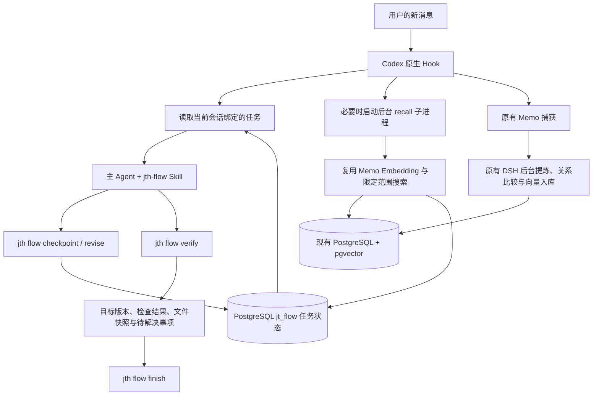

# 流程控制原型

## 解决的问题

保持长任务的当前目标、用户约束、工作阶段和恢复位置。典型失误是用户补充“流程轻一点”后，Agent 把“解决长任务偏移与失忆”改成研究轻量框架；或把讨论中的候选当成已决定方案并开始实施。

这一版通过独立任务状态与重复注入减轻这些问题。主 Agent 仍负责理解需求、选择下一步和判断语义是否对题；工具负责持久化、单一主控、事件适配、记忆召回和实际检查。

## 运行链路与责任

`packages/flow` 拥有任务、PostgreSQL 存储、上下文渲染、检查执行和 Skill；不导入 Memo 或 Codex SDK。`packages/codex-hooks` 适配 Codex JSON 事件，复用原来的配置合并和原子写文件。`packages/cli` 调用这两个包，并通过 Memo 的公共 API 完成召回。`packages/memo` 保留存储、版本、冲突处理和队列；模型校验失败最多修复一次，不放宽发布规则。

使用现有 `pg` 驱动、`pg_ctl`、Node 24 自带的 `node:util.parseArgs`、进程 API、Git 文件清单、已有 Zod 和 Memo API。`node:sqlite` 仅用于一次性读取旧库迁移。没有增加运行时第三方依赖、HTTP 服务、调度常驻服务或新 Agent 框架，也没有复制 Trellis 实现。

## 状态与恢复

每个任务保存当前目标、不可覆盖的初始目标、验收条件、范围、约束、阶段、决定、未决问题、近期进展、下一步和验收结果。PostgreSQL 事务与按 workspace 的事务锁保证一次更新完整落盘，并发检查点不会互相覆盖；事件表保留目标变更和检查点。普通状态只展示最近 8 条进展和决定，`status --history` 查看最近 30 次事件，避免每次读取重载全部旧上下文。

`checkpoint` 追加约束和进展，不能修改目标。`revise` 要求明确说明用户变更的依据，并让旧验收结果失效。讨论转实施也需要记录依据，但不要求用户重复授权。程序检查依据是否存在，无法独立判定依据的语义是否真实。

会话绑定独立保存。新会话不会自动接续最近一个不相关任务；主控接管用显式 `resume --takeover`，原主控转为观察者。SubagentStart 关联父任务，子会话不能修改主目标。阶段只由主控命令改变，停止生成、被中断或关闭会话不等于完成任务。

Hook 在 SessionStart（包括 compact）、UserPromptSubmit 和 SubagentStart 注入当前目标、阶段、验收条件、约束、少量近况和缓存记忆。其余生命周期只记录 `lastEvent` 与时间。重要边界保持原文；进展和历史记忆只给摘要，需要详情再读状态或条目。目标与边界的核心记录限制为 8000 字节，超长时要求明确拆任务，不静默截断核心约束。

## 与 Memo 的结合

自动召回使用任务目标和约束生成查询，复用现有 Embedding 配置。在已安装的项目、业务和用户范围中搜索，沿用 Memo 的 active/conflicted、已断言/观察/验证条目过滤规则；不把候选建议、已归档或已失效条目重新当事实。缓存保存条目 ID、状态、来源会话和短内容；实际冲突必须再用 `memo read` 查看双方证据。

5 分钟缓存减少输入时的重复 API 调用；90 秒刷新租约防止每条消息启动同样的工作。任务目标或约束变动后重新召回。请求标识阻止过时结果覆盖新任务上下文。后台进程失败时保留原目标和进度，错误可见；重试使用 `flow recall`，不阻塞正常会话。

长期写入继续来自原会话材料，经过已有 DSH Agent 与 Memo 持久化流程。没有额外把任务检查点直接写成“用户事实”，也没有在主会话恢复自动 `memo record`。记忆是历史资料，当前任务状态是本次执行依据，两个 owner 各自唯一。

## 验收边界

`verify` 串行运行任务中记录的检查命令，保存每项退出码、超时标记和日志。开始重新验证即撤销旧的通过资格，防止被中断的重跑仍使用以前的绿色结果。超时或中断终止对应检查进程组；即使命令处理 SIGTERM 后以 0 退出，也不会判定成功。

`finish` 检查未决问题与阻塞是否清除、目标版本是否一致、检查是否通过，以及验证后文件是否改变；有 `--scope` 时检查任务开始以来是否出现范围外改动。Git 提交本身不改变文件内容，因此不会使验收失效。无可执行检查的实施交付可以提供项目内真实文件作为人工可查证据；文件存在不等于内容自动满足需求。

文件快照基于 Git 的已跟踪及未忽略文件，不包含 `.jth` 等运行目录。当前按整个工作树比较，因此同一工作树的其他并发改动可能要求重新验收或产生范围提示；需要并行实施时使用各自 worktree。它没有拦截每次工具调用或 shell 读写，不是访问控制或安全沙箱。

## 社区参考

- [Trellis](https://github.com/mindfold-ai/Trellis/tree/e77ae89f648a78d5859fa2e8ac314655898421a5)：借鉴每任务状态、会话指针、任务上下文与 Hook 注入的组合。没有引入其完整工作流或多 Agent 编排。
- [Codex 官方 Hooks 文档](https://learn.chatgpt.com/zh-Hans/docs/hooks)：采用原生事件、JSON `additionalContext` 与 Hook 信任机制。以本机 Codex 0.153.0 生成的 app-server schema 核对实际字段。

本原型不声称仅凭几条提示就能杜绝模型偏移。可验证的机制是目标不被普通检查点覆盖、压缩/恢复时重新提供状态、限制摘要规模、单一主控和有效验收；语义效果需要接下来在真实长任务中观察。

## 数据库离线与旧版本迁移

Flow 状态全部持久化在 `jt_flow`，和 `jt_memo` 复用同一 PostgreSQL 实例。Hook 使用 200 ms 连接超时和 500 ms 语句超时；数据库冷启动由后台承担。暂时不可用时将生命周期事件保存到 `.jth/flow-events/`，并明确提示上下文未恢复；后台和后续 CLI 调用重放事件。事件带原始接收时间，旧事件不能倒退会话最新活动。

`jth flow migrate` 使用 SQLite 在线备份接口取得一致快照，将设置、任务、主从会话及完整历史一次事务导入 PG，再写入 `.jth/flow.json` 配置定位。相同快照可重试，不会覆盖已更新的 PG 任务；不同快照与已有数据冲突时拒绝覆盖。迁移后原 SQLite 与备份只作回退材料。数据备份的路径和计数由命令回执给出。

PG 由明确配置的本机原生工具管理，正常 SQL 命令负责按需启动。并发启动依赖 PostgreSQL 自身的 postmaster 锁；启动后核对实际 data_directory，避免接管其他实例。它是按需启动，不额外注册开机服务；单次 CLI 退出不关闭共享 PG。
