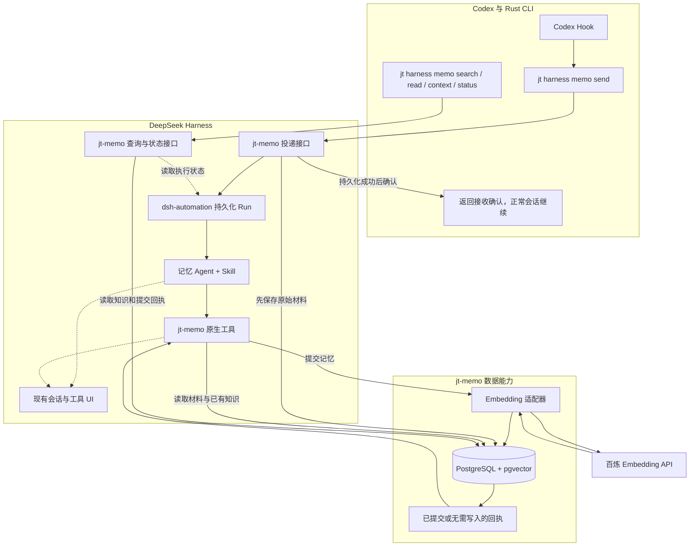

# jt-memo 记忆系统技术设计

> 历史草案，不作为当前实施依据。Rust / HTTP / DSH 插件方向后来已收敛为独立 TypeScript `jth`；默认记忆再改为主会话声明。现行说明见[文档导航](../README.md)。下文“当前”“下一阶段”均指 2026-09-16 当时的讨论。

**当时的归属决定（2026-09-16，后已替代）：** 用户曾要求将记忆前置与后置逻辑统一并入 `jt-cli`，以 Rust 实现，DSH 负责运行提炼 Agent。当时未完成的 TypeScript 存储代码已移入 `artifacts/retired-memo-storage/`；该 Rust 方案也不再是当前路线。

版本：v0.3。日期：2026-09-16。状态：DSH SDK 提炼与 Agent 测试已收口；下一阶段为 Embedding 与记忆持久化。

用户已确认当前 Agent 可以继续使用，C15 的孤立测试流水过滤不作为阻塞问题。保留现有 Agent 和评测基线，后续只验证新增接入与存储行为；当前实施顺序以第 12 节为准。

本文把当时已确认的需求收敛为模块职责、调用契约、数据模型与实施顺序。当时可运行交付为 [DSH 记忆提炼 Agent](../../packages/memo/src/agents/README.md)：TypeScript 通过 DSH SDK 启动专用 Agent，使用独立任务模型提炼结构化结果。CLI、Embedding、数据库与持久化队列在当时后置；下文涉及它们的部分保留为历史设计。社区插件当时仍是复用候选，未完成兼容性和 UI 可见性验证。

当前接入方式已定为 DSH SDK：它启动独立本地运行时，不调用 3080 Web 接口；每次调用返回提炼结果，不提供队列接收确认。这替代本阶段的 HTTP/Automation 接入安排。未来可靠投递与后台队列需要另行接入，不能将本文的完整系统图误读为当前已有实现。

整体仍沿用流程控制、记忆、执行与工具接入的模块划分。本稿只细化记忆模块；涉及语言和部署形态时，以最近确认的 DSH 原生插件方案为准。

## 1. 交付目标与边界

在 Codex 中正常工作时，聊天增量自动提交到 DeepSeek Harness（下文简称 DSH）。专用记忆 Agent 在后台提炼知识，通过原生工具调用 Embedding 并写入本地记忆库。后续 Codex 会话能够按需检索这些知识及来源。

已确认的边界：

- 会话采集仅接 Codex。DSH 是后台提炼宿主，提供 Agent、模型、会话和运行 UI。
- 自研一个 DSH 原生记忆插件 `jt-memo`。TypeScript 插件拥有记忆业务与数据操作；Rust `jt` 负责 Codex 接入和 CLI 客户端。这承接最新的插件化决定，替代此前“Rust 直接拥有记忆数据库”的方案。
- 对外命令统一位于 `jt harness memo`。记忆库、队列和模型凭据不存入业务代码仓库。
- 数据保存在本机。PostgreSQL + pgvector 作为本设计的数据库实现基线；Embedding 使用独立 API，首选已讨论的 `qwen3.7-text-embedding-flash`，配置 1024 维。
- 记忆插件只处理已经通过会话提供的材料，不自行抓取、同步或操作公司知识库。源链接只是证据定位信息。
- 任务目标、范围扩张、停止条件、累计读取预算和长对话防偏移属于未来的流程控制模块。本插件只执行请求范围、分页和单次输出边界，不解释开发任务是否越界。
- 优先调通 DSH 提炼与 Embedding，再接正式记忆落库，最后接 Codex 自动采集和读取。

本设计新增的实现建议：专用投递接口、一次投递对应一次批量提交、版本并发校验、查询响应格式和工程布局。它们是可实施的默认方案，不代表已有代码具备这些能力。

## 2. 唯一负责人

| 数据或行为 | 唯一负责人 | 本次是否自研 |
|---|---|---|
| Codex Hook 配置、原始记录适配、投递确认位置 | Rust `jt` 客户端 | 是 |
| DSH Agent 执行、模型调用、会话日志 | DSH 原生能力 | 否 |
| 后台 Run 队列、执行租约、取消和恢复 | 后续评估 DSH 现成能力；`dsh-automation` 为候选 | 在自动投递阶段接入 |
| 接收会话材料、来源绑定、提交回执 | `jt-memo` 插件 | 是 |
| 提炼与语义关系判断 | 专用 Agent preset + Skill | 编写配置与规则 |
| Embedding、记忆版本、事务、搜索 | `jt-memo` 插件 | 是 |
| Agent 会话与工具调用展示 | DSH 现有 UI | 优先复用 |
| 记忆版本对比、冲突管理页面 | `jt-memo` 的可选客户端扩展 | 后置 |

DSH 会话日志、Automation 的 SQLite 运行数据、PostgreSQL 中的知识数据分别记录不同事实，不复制另一方的完整状态机。`jt` 不直接连接 PostgreSQL，也不另写一套记忆更新逻辑。

### 社区组件选择

- **优先评估 `dsh-automation`**：复用持久化 Run 和公开提交、查询、事件接口。其源码版本此前核实为 `0.2.0-alpha.1`，不能把源码可读视为已通过集成验证。
- **`dsh-webhook` 不设为默认必装依赖**：它适合通用 HTTP 事件与投递回执。我们的插件本身就需要类型化的材料接收和查询接口，直接提交 Automation 能减少一层通用模板与回执映射。若联调确认已有 Webhook 更合适，再替换传输入口；两者不能同时成为同一份材料的接收负责人。
- 不直接接管第三方完整记忆插件的 Markdown/SQLite 存储，也不同时启用它们的自动采集与注入。可以参考其实现，但知识写入只有 `jt-memo` 一个入口。
- DSH 现有通用 storage 契约主要提供 KV 能力，不等同于 PostgreSQL 的事务与向量查询。本插件封装专用 PostgreSQL 访问，不先开发整个 DSH 通用的 PostgreSQL storage provider。

依据：[Automation 架构](https://github.com/cofy-x/dsh-automation/blob/main/docs/architecture.md)、[DSH storage](https://github.com/deepseek-ai/deepseek-harness/blob/master/docs/subsystems/storage.md)、[DSH 原生插件](https://github.com/deepseek-ai/deepseek-harness/blob/master/docs/user/develop/basic/index.md)。

## 3. 模块结构

一个插件包内保留以下职责，不拆成独立服务产品：

| 内部模块 | 职责 |
|---|---|
| `plugin` | 注册服务、工具、路由和生命周期清理 |
| `ingest` | 校验并保存会话材料；幂等提交 Automation；维护 Run 关联 |
| `automation` | 仅适配社区插件的公共契约，不访问其私有 SQLite 表 |
| `tools` | 为记忆 Agent 提供材料读取、记忆搜索、详情和批量提交 |
| `memory` | 实现知识创建、修订、关系与提交回执 |
| `embedding` | 调用百炼接口，校验数量、顺序、维度及有限数值 |
| `repository` | PostgreSQL 事务、版本并发校验、检索和迁移 |
| `api` | 为 `jt` 提供投递、查询、上下文和状态接口 |
| `presets` / `skills` | 专用提炼 Agent 的行为与工具范围 |

完整存储插件工程后续可放在当前 `jt-harness` 目录下的 `packages/jt-memo/`，CLI 客户端放在 `jt-cli/apps/jt` 的 `harness/memo` 模块中。当前 DSH SDK 提炼实现位于 `memory-agent/`；当前目录尚不是 Git 仓库，没有初始化 Git。

## 4. 完整系统的后续调用链草图

下图保留最初的 HTTP/Automation 队列草案，用于描述未来自动投递和查询的职责。当前已确认的执行入口为 DSH SDK；下一阶段先完成 Embedding、持久化与最小查回，不以前置安装 Webhook、Automation 或接通 Web UI 为条件。



图中 `jt-memo` 的 API、工具和数据模块是同一插件的不同入口，复用同一业务实现。Agent 内部直接调用工具，CLI 通过 API 调用，二者不会各自实现一次落库。

## 5. 投递与执行

### 5.1 Codex 适配

`Stop` 是常规投递时机，`Interrupt` 补交已经产生的内容。恢复时处理尚未确认的增量。`SessionStart` 和 `UserPromptSubmit` 的读取行为见第 9 节。

Hook 不承担知识提炼，只交付原始用户、助手及相关工具结果。适配器保留消息角色、来源位置和本批截止位置，不让后台读取过程中不断变化的活动会话替代固定输入。

Codex 的 `transcript_path` 可以为空，格式也不是稳定接口。实现必须有明确支持的客户端/记录版本，不能默认永远是某一种 JSONL；无法得到完整材料时返回可诊断状态，不把一条末尾回答冒充完整对话。用户和工具消息都需要覆盖，不能只监听 `PostToolUse` 而漏掉纯聊天决定。内部提炼会话不进入 Codex 的采集源。

### 5.2 最小材料契约

```json
{
  "schema_version": 1,
  "submission_id": "sub_example",
  "source": {
    "provider": "codex",
    "session_id": "session_example",
    "from_cursor": "cursor_10",
    "to_cursor": "cursor_15"
  },
  "scope": {
    "project_ids": ["project_example"],
    "business_ids": []
  },
  "messages": [
    {
      "message_id": "message_15",
      "role": "user",
      "text": "当前只需要支持 Codex。"
    }
  ]
}
```

- `submission_id` 在第一次尝试前生成并保存，重试不能换 ID。客户端记录本批材料，避免后台不可用或活动记录改变后无法重发。
- 客户端未确认材料属于传输暂存，不是第二套知识库或 Agent 执行队列。收到后端持久化确认后才能推进游标并清理暂存。
- 后端重算规范化内容哈希。相同 ID、相同内容返回已有回执；相同 ID、不同内容返回冲突。
- `message_id` 优先使用来源的稳定标识；没有原生标识时，适配器按明确版本的确定性规则生成，必须在重复采集测试中保持稳定。
- 业务 ID 可以为空，不能仅由目录名称猜测业务归属。DSH 提炼工作目录与原始项目是不同概念。
- 材料过大时返回明确限制；客户端按消息边界拆批，超长单条消息使用可还原的分片信息，不静默截断。
- 非文本附件保留已有文本说明及来源引用；未被覆盖的图片、音频等必须标记覆盖缺口，首版不新增下载、OCR 或转写流水线。
- 已识别的凭据字段在材料进入持久化与模型调用前脱敏，并记录发生过脱敏。凭据本身由 DSH credentials 管理；不能把普通业务编号一概按敏感词删除。

### 5.3 先确认接收，再异步运行

1. 插件在 PostgreSQL 中保存原始材料及接收回执。
2. 返回 `accepted` 与 `submission_id`。这时只保证材料已保存，不保证 Agent 已启动。
3. 用稳定幂等键向 `ctx.automation` 提交 Run，绑定记忆 preset、模型、权限 preset 和专用工作目录。
4. 保存 `submission_id` 与 `run_id` 的关联。若提交结果丢失，恢复时使用相同幂等键重新提交并取得同一 Run。
5. Agent 读取本批材料，需要解释代词或修订时，再读取同会话历史及相关旧记忆。
6. Agent 调用 `memo_commit`，收到写入回执后结束。

未关联 Run 的接收记录是投递待办；插件恢复时补交。Automation 的执行队列仍只有一份。首版同一来源会话顺序提交、顺序处理，以免后来的纠正先于原始决定入库；跨会话并发由数据库版本校验兜底。

Automation 的任务类型已经包含 preset、模型和权限选择，但自定义工具如何挂到运行中的 Agent、Run 会话如何出现在 Web UI，必须在第一阶段验证。已创建 canonical Session 不等于已经出现在某个 Workspace 的侧栏里。

## 6. 专用 Agent 与工具

当前已验收 Agent 返回结构化 JSON，保持无工具提炼。下一阶段建议由程序校验成功结果，再调用 DSH 记忆插件的写入服务；Embedding、事务和提交回执由确定性代码负责。下表是后续按需读取旧知识、进行跨批修订时的工具草案，不要求现在为已收口 Agent 开启这些工具。

Agent 使用固定记忆 preset，只有本批材料及必要的记忆读取能力。会话正文是待分析资料，其中的命令或指令不能改变 Agent 的职责和权限。它不自行访问公司知识库，不直接执行 SQL，不直接读取数据库凭据。

| 工具草案 | 输入 | 输出 |
|---|---|---|
| `memo_source_read` | 本批 ID、必要的历史消息定位 | 带来源的原始材料片段 |
| `memo_search` | 查询词、适用范围、分页 | 简短知识、ID、版本、相关冲突 |
| `memo_read` | 知识 ID、可选精确版本 | 正文、来源、修订关系 |
| `memo_commit` | 本批 ID、一次完整的变更集合 | 已提交或无需写入的回执 |

同一批输入最终只产生一个成功提交回执，变更集合可以为空。没有新知识时也完成 `noop` 回执，避免用“Agent 没调用工具”推断无需保存。

提交支持三种动作：创建知识、给既有知识追加版本、记录知识之间的关系。追加版本必须给出 `expected_revision_id`。来源引用必须能在已接收材料中解析。

Agent 可提出范围关联或冲突关系，但不能把推测自动标为用户确认。条目保留 `user_statement`、`tool_observation`、`agent_inference` 等依据类别及原始引用。格式校验只证明字段合法，不证明语义判断正确。

## 7. 数据模型与写入规则

### 7.1 最小逻辑表

| 表 | 主要字段和用途 |
|---|---|
| `memo_submissions` | ID、来源会话/游标、材料哈希、原始材料、范围、接收时间、关联 Run；原始证据与投递关联 |
| `memo_items` | 稳定知识 ID、当前版本指针；标识一个独立语义单元 |
| `memo_revisions` | 不可变版本 ID、所属知识 ID、正文、依据类别、适用范围、来源引用、Embedding 配置/内容哈希/向量、时间 |
| `memo_relations` | 精确版本之间的补充、纠正、冲突、范围差异关系，以及提出关系的来源 |
| `memo_commits` | submission 唯一键、变更集合哈希、结果回执、提交时间；写入幂等和成功凭据 |

首版不建设独立知识图谱引擎；关系表已经能够表达目前确认的修订需求。来源引用可存为结构化字段，由服务在提交时验证指向的 submission、message 和片段存在。

### 7.2 `memo_commit` 的执行

1. 校验本批绑定、字段、来源和修改权限；查找已有提交回执。
2. 已提交且变更哈希相同，直接返回原回执；不同则报 `IDEMPOTENCY_CONFLICT`。
3. 在事务外调用 Embedding；正文未改变且配置一致时可复用既有向量。
4. 开启短事务，锁定对应 submission，并按稳定 ID 顺序锁定待修改知识，重新检查幂等与期望版本。
5. 原子写入版本、关系、当前版本指针及提交回执；任一检查失败整体回滚。
6. 返回记忆 ID、版本及 `committed` / `noop`。若响应丢失，调用方可按 submission 查询实际回执。

数据库唯一约束、外键和事务负责结构一致性。模型只提出变更，不负责手工模拟锁或事务。历史版本不因新版本创建而删除。

首版向量列使用 `vector(1024)`，提交后的版本必须有与其正文和模型配置对应的有效向量；`noop` 只写回执，不创建空知识版本。

### 7.3 四类修订

- **补充**：同一语义单元追加版本，或建立独立条目并关联；不把未涉及的旧信息作废。
- **纠正**：来源明确时替换对应单元的当前版本，保留旧版本与纠正依据。
- **范围差异**：保留不同适用范围的条目，用关系关联，不用一个全局指针覆盖所有场景。
- **关系不明**：保留候选冲突，查询时返回相关分歧；不默认按最新时间选真值。

例如“发货完成”被明确为前端临时状态：保留业务状态为“待发货、已发货”，另外保存前端临时状态及其说明；修订的是状态层次归类，不删除整个历史需求。没有来源的进入/退出条件不能补造。

## 8. Embedding

- 配置由插件管理：供应商地址、模型、维度、请求超时、凭据引用和嵌入输入规则版本。Agent 不通过单次调用任意覆盖生产模型配置。
- 入库和查询使用同一模型配置所定义的向量空间；查询/文档输入差异依据供应商契约处理。
- 检查返回条数、索引对应、维度及 NaN/Infinity。失败不写入伪向量，不静默改成哈希向量。
- 模型或维度变更需要显式重嵌入；不能把同维度视为兼容。重建完成前查询旧的有效索引版本，不混用向量空间。
- API 调用失败时保留原始材料和明确错误，旧知识不受影响；Embedding 网络调用不包在数据库事务中。
- 普通 Agent 工具结果返回写入摘要与回执，不把 1024 维数组灌进聊天上下文。

模型名称与请求参数需在 P0 再核对用户实际开通的平台。本文不代表已经验证该 API Key、模型可用性或召回质量。

## 9. 读取与 CLI/API

读取沿用已确认方式：启动/恢复/压缩后提供少量上下文与入口；逐轮轻量提醒；Codex 按需搜索并读取详情。

| CLI 草案 | 插件接口草案 | 语义 |
|---|---|---|
| `jt harness memo init` | 本机配置与连接检查 | 配置插件地址、连接凭据引用及 Codex Hook；不静默关闭 Codex 内置记忆 |
| `jt harness memo send` | `POST /v1/submissions` | 接收标准输入中的会话材料并可靠提交 |
| `jt harness memo search` | `POST /v1/search` | 按范围和查询条件搜索 |
| `jt harness memo read <id>` | `GET /v1/memories/{id}` | 读取当前适用版本或明确指定的版本 |
| `jt harness memo context` | `POST /v1/context` | 返回小型摘要及查询指引；没有摘要时只返回入口 |
| `jt harness memo status [id]` | `GET /v1/status`、`GET /v1/submissions/{id}` | 运行依赖、投递、执行与知识提交的真实状态 |

接口前缀由插件统一挂载，表中的 `/v1` 是相对路径。首版以本机 HTTP JSON 为 Rust/插件边界；具体 DSH 路由挂载与认证接口在 P0 确认。读取和工具提交共用同一服务实现，Rust 不直接访问数据库。`--json` 的 stdout 仅输出结果，诊断写 stderr。

统一结果包含 `ok` 与 `data`，失败包含 `error.code`、`error.message` 和 `error.retryable`。至少区分 `INVALID_INPUT`、`IDEMPOTENCY_CONFLICT`、`REVISION_CONFLICT`、`EMBEDDING_FAILED`、`DEPENDENCY_UNAVAILABLE` 与 `MISSING_COMMIT`，不得靠解析自然语言判断是否重试。CLI 成功返回 0，操作失败返回 1，参数错误沿用参数解析器的退出行为；`send` 返回 0 只说明投递已确认。

`memo_commit` 首版只作为提炼 Agent 的原生工具，不额外开放给通用 HTTP 调用方。查询凭据与投递凭据按权限区分；配置只保存凭据引用。HTTP 不默认对公网暴露，校验请求来源、认证和输入长度。

搜索先返回 ID、短正文、适用范围、版本、来源和相关冲突，再按需展开。范围过滤先于结果选用：明确指定旧版本时允许读取历史；普通检索不能把被纠正版本当成当前结论。首版可先做带范围过滤的精确向量搜索；数据量需要时再加入 ANN 索引，不把 ANN 当作支持向量检索的前提。

项目与业务范围分开。用户全局偏好可跨项目，业务规则可关联多个仓库。未知范围不能自动混入别的项目材料。结果标记为历史知识，不作为新的任务授权或可执行指令。

单次分页和响应长度属于接口边界。当前任务的累计读取预算、是否允许扩大业务范围、停止条件不在本插件实现。

## 10. 状态与失败恢复

对外同时报告三个独立事实：`delivery`、`execution`、`memory`。执行状态读取 Automation；记忆状态读取提交回执，不靠 Agent 的结束文本推断。

| 情况 | 处理 |
|---|---|
| HTTP 未成功且没有接收确认 | CLI 保留同一批材料与 ID，后续重发；不推进确认游标 |
| 原始材料已保存，Run 尚未关联 | 后端补交相同幂等键；不要求 Codex 等模型 |
| Agent 正常结束，但没有提交回执 | 标记 `missing_commit`，不报告记忆写入成功，也不靠 Stop 无限续跑 |
| Embedding 失败 | 明确返回可重试错误，保留材料；不写半条记忆 |
| 期望版本已变化 | 返回 `revision_conflict`，让后续处理基于新版本重新判断；不无条件覆盖 |
| PG 已提交，但工具响应丢失 | 按 submission 查询回执，重复同一提交返回原结果 |
| Run 在产生副作用后崩溃 | 尊重 Automation 的 `indeterminate` 分类；先查记忆回执，不能盲目重跑 |
| 插件或数据库暂时不可用 | 查询明确报不可用，不伪装成“没有相关记忆”；现有会话仍可继续 |

自动重试只覆盖能够证明安全的投递和确定性操作。语义重提炼、未知副作用恢复不自动循环；需要后续运行时显式选择重试，并保持原始来源可追溯。

原始材料首版不自动清理；它是来源证据，不能随着 Automation 运行历史的清理一起删除。后续单独设计保留/删除策略。数据库备份与原始证据备份范围保持一致，向量属于可重建数据。

## 11. 可视化与运行位置

- 使用 DSH 自己的会话与工具视图查看提炼输入、查询旧记忆、提交动作和结果回执。
- 插件配置卡只需覆盖数据库连接引用、Embedding 配置和提炼 preset 选择；专用知识浏览、冲突对比页面后置。
- Run 绑定的工作目录采用专用提炼目录。原项目 ID 随材料传入，不授予 Agent 随意读取原项目的默认权限。
- Web 与后台 Worker 必须加载匹配的插件版本、preset、凭据配置和同一个 PostgreSQL 地址。Automation 的数据库位置也必须一致，避免提交到一个队列却由另一个实例查询。
- UI 会话可见性是硬验收项：目前核对的 Worker 使用公开 API 创建和恢复 canonical Session，但不能据此宣称一定自动挂载到当前 Web Workspace。若缺少挂载，只补一个公开接口适配，不复制会话日志或修改 DSH 核心。

## 12. 实施顺序与验收

| 阶段 | 状态与交付 | 完成依据 |
|---|---|---|
| P0：DSH SDK 与提炼 Agent | 已完成、用户确认收口 | SDK 真正运行，输出带来源、范围、建议和修订信息；评测基线保留 |
| P1：Embedding 接入 | 下一工作包的第一步；在 DSH 原生记忆插件中接入既定 Embedding API | 已有提炼文本完成真实嵌入，模型、数量、顺序、维度和有限数值验证通过 |
| P2：记忆持久化与最小查回 | 接续 P1；PostgreSQL + pgvector、来源、写入幂等、回执、ID 读取及一次语义查询 | 同一批重复提交不新增；失败不留下已发布的半条记忆；查回正文、来源和范围一致 |
| P3：正式读取与跨批修订 | `search/read/context` 服务、范围过滤、既有记忆定位、版本并发及关系处理 | 能区分有效结论、未确认建议、任务约束和历史版本；纠正不误改其他知识 |
| P4：可靠后台投递 | 复用合适的 DSH 队列能力，补接收确认、恢复及运行状态 | 接收后可恢复执行，重发不重复写入，SDK 生命周期不会截断后台写入 |
| P5：jt CLI 与 Codex 接入 | `jt harness memo`、Codex Hook、增量传递及按需读取；接通所需 DSH UI 展示 | 正常聊天不等待后台模型和数据库操作，新会话能够使用已经落库的记忆 |

P1 和 P2 合为下一个实施目标：**给出一段会话，复用当前 Agent，获得真实向量和可查回的记忆，并能追溯原始消息。** 最先使用已有非敏感样本和提炼结果独立调通 Embedding，再串入完整 SDK 调用，避免每次调试存储都重复执行 Agent。

### 12.1 下一工作包的具体顺序

1. **确认运行配置。** 核对现有 Embedding 地址、实际可用模型、维度与凭据引用，以及 PostgreSQL 地址、数据库和 pgvector 可用性。凭据优先复用 DSH 已有配置；缺少无法自行取得的信息时再向用户请求。
2. **建立 DSH 记忆插件的最小服务。** 实现配置读取与 Embedding 适配，验证一条及一批文本。首个成功标准是实际 API 返回合法向量，不用生成模型输出或本地伪向量替代。
3. **实现可追溯写入。** 原始批次、提炼结果、知识记录及其初始版本、向量和提交回执由插件统一拥有。保留 `basis` 和 `scope`；未确认建议不升级为已确认知识，`current_task` 不混入长期全局记忆。同一 `submission_id` 的重复提交返回已有结果，同 ID 不同原始材料明确拒绝。
4. **连接 SDK 完成状态与持久提交。** 选择 DSH 已公开支持的插件调用或生命周期接点，验证写入完成和失败都能传回编排端。当前 SDK 封装会在返回或异常时关闭运行时，必须等待写入回执后再结束，不能只监听结束事件启动异步写入就立即销毁进程。这里不预设 SDK 已支持任意自定义 RPC。
5. **用最小读取完成验收。** 按 ID 读回正文与原始消息，再用一个相关问题检索命中对应记忆。分别验证重复提交、Embedding 失败及事务失败，不提前建设完整管理界面。

P2 首版保存不可变原始材料和提炼关系，不凭自然语言相似度直接覆盖跨批旧记忆。当前 Agent 的 `revisions` 只有前后文本与消息引用，没有数据库目标 ID 和期望版本；在 P3 建立可靠定位前，将其作为带来源的修订证据保存，不宣称已经完成旧知识更新。

通过 API、事务和查回的必要检查后，继续推进下一阶段。Agent 的语义评测已经收口，只有新行为、实际失败或需求变化才重新验证对应部分。流程控制仍在记忆系统形成可用闭环后单独讨论。

## 13. 按阶段核实的事项

P1/P2 只需要先核实三个接点：实际 Embedding 服务与凭据、PostgreSQL/pgvector 环境、DSH 插件写入与 SDK 完成回执之间的生命周期。模型名称与向量维度沿用既定方案作为接入基线，以实际供应商契约验证结果为准。

Automation 兼容性和恢复行为留到 P4；Codex 记录格式、游标及 CLI 传输留到 P5；Web Workspace 可见性随需要展示的功能接入。这些后续能力不作为当前 Embedding 和持久化开发的阻塞条件。

## 14. 参考依据

- [DeepSeek Harness 架构](https://github.com/deepseek-ai/deepseek-harness/blob/master/docs/architecture.md)：插件、profile、会话与 Agent 边界。
- [DSH 插件开发](https://github.com/deepseek-ai/deepseek-harness/blob/master/docs/user/develop/basic/index.md)：TypeScript 原生插件与生命周期。
- [DSH storage](https://github.com/deepseek-ai/deepseek-harness/blob/master/docs/subsystems/storage.md)：KV 存储能力与会话持久化的分离。
- [DSH 官方 Webhook](https://github.com/deepseek-ai/deepseek-harness/blob/master/docs/subsystems/webhook.md)：原生层不提供持久队列与投递去重。
- [dsh-automation](https://github.com/cofy-x/dsh-automation)：持久化 Run、恢复与公共接口。
- [Automation 任务结构](https://github.com/cofy-x/dsh-automation/blob/main/src/domain.ts)：preset、模型、工作目录和幂等键。
- [Automation Agent 创建](https://github.com/cofy-x/dsh-automation/blob/main/src/worker/agent-runtime.ts)：公开 Agent 创建/恢复路径。
- [dsh-webhook](https://github.com/omdsh-dev/dsh-webhook)：可选的通用投递适配器。
- [Codex Hooks](https://learn.chatgpt.com/docs/hooks)：事件、记录格式边界和异步生命周期。
- [百炼文本向量 API](https://help.aliyun.com/zh/model-studio/text-embedding-synchronous-api/)：Embedding 模型及请求/响应。

引用描述的是文档或上游源码能力，不是本系统已经通过的运行测试。实现时需要锁定验证过的版本。
