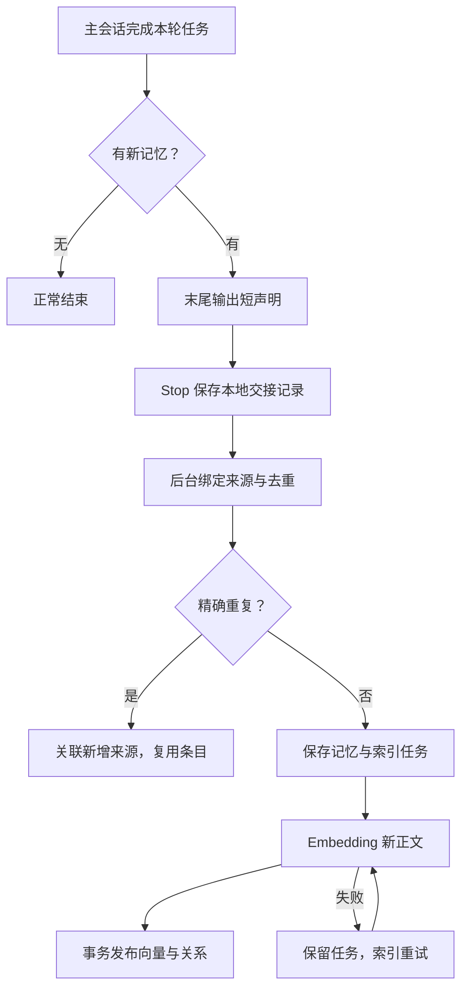

# 主会话记忆声明

2026-09-20 起，默认记忆写入由主会话在正常回复末尾声明结论。后台直接保存、去重、生成 Embedding；不再运行独立的 DSH 提炼或关系比较。保留 PostgreSQL、pgvector、来源、版本、冲突、归档、审核和索引恢复能力。

## 流程与开销



安装只写入一段固定项目说明。每轮最多三条声明，记忆正文合计最多 500 个 Unicode 字符，每条原文引文最多 240 字符。来源 ID、时间和版本由程序补齐。没有新记忆时不输出声明，也不产生记忆写入的 API 调用。

后台在本机读取来源日志；发送给 Embedding 的只有新记忆正文。聊天记录、引文、工具输出和存储字段不会重新发送给提炼模型。检索继续调用查询 Embedding：普通 `memo search` 默认返回三条摘要，详情按需 `memo read`。原生 Flow 按需调用这些工具；五分钟缓存和自动召回只保留在显式旧 Flow 路径。

## 声明契约

最终回复末尾独立一行，使用以下格式；代码块内的示例不会被处理：

```text
<!-- jth-memory {"items":[{"text":"项目使用 pnpm 管理依赖。","scope":"project","basis":"user_statement","quote":"项目使用 pnpm"}]} -->
```

`scope` 使用已有的 `project / business / user / current_task / unspecified`。事实依据为 `user_statement / user_confirmed / tool_observation`；未确认建议可用 `assistant_proposal / agent_inference`，进入候选集合。`quote` 是此前真实消息中的短连续原文，不用声明自身作为证据。

主 Agent 要更正、补充或标记冲突时，先读取旧记忆：

```sh
jth memo read <旧条目ID>
```

CLI 在当前 Codex 会话下保存读取版本。随后给对应声明加 `"change":{"kind":"correction","target":"旧条目ID"}`；补充、冲突分别使用 `supplement`、`conflict`。模型不需要输出版本哈希。手动测试时可用 `memo read <ID> --source-session <会话ID>` 绑定实际读取。

## 存储与更正

- 重复 Stop 使用相同声明 ID，返回原回执。
- 同范围、同依据、同有效期、同实体集合的精确重复正文复用已有条目；已具备同一向量空间的向量，或已有排队中的索引任务时，不再新建索引。
- 新出现的来源保存到 `declaration_receipts` 和 `declaration_sources`；原条目正文与原始来源不改写。`memo read` 的 `additional_sources` 展示最近二十个新增来源，完整证据留在回执中。
- 语义变化由主 Agent 声明明确关系。更正沿用读取版本检查与发布事务，旧正文保留；补充保留双方；冲突保留双方证据。程序不按相似度覆盖记忆。
- 已归档、拒绝或被更正的旧条目不会被精确去重重新激活。项目和业务范围集合必须一致；任务记忆还要求同一来源会话。

schema v7 只新增声明回执、来源关联与内容索引。旧会话、DSH 队列、条目、向量和回执保持原样。

## 运行与恢复

需要启用的项目执行：

```sh
jth memo codex install --project <项目ID>
jth memo codex status
jth memo status --summary
jth memo work
```

安装管理项目 `AGENTS.md` 的 `JTH_MEMORY_START/END` 区间，以及一个 Memo Stop Hook。重新安装替换旧 Memo 六阶段捕获，保留 Flow 和其他工具的 Hook。主 Agent 核对子 Agent 结果后统一声明。卸载使用 `jth memo codex uninstall`，不删除已保存的数据。

Hook 只保存本地事件与来源指针，后台负责解析、数据库和 Embedding。来源暂存继续使用已有硬链接机制，来源文件与数据目录应在同一文件系统。异常处理沿用以下边界：

- 格式或引文无法解析：原声明和诊断保存在 `~/.jth/codex/declaration-errors/`，`memo codex status` 可见；正常回复继续，不调用模型修补。后续有明确修正时可重新声明。
- 数据库无法接收：有效声明留在本地待投递文件，`memo work` 继续投递。
- Embedding 失败：正文和来源已经保存，`memo retry <submission-id>` 只重试索引。
- 旧 DSH 任务：只有 `memo work --legacy`、`memo send ... --legacy` 或 `memo retry ... --legacy` 才会执行。默认后台不消费旧 DSH 队列。

本次没有给实际仓库安装 Hook；实际 `.codex/hooks.json` 继续为 `{"hooks":{}}`。Flow 阶段规划、工作回执和验收通过 CLI 手动运行。

## 验证结果

真实 Embedding 验证运行于隔离 PostgreSQL，使用人工构造的 Codex 会话及声明，不启动提炼模型。API 配置读取已有 `.env`；测试结束删除临时数据库。2026-09-20 实测：

| 用例 | 结果 | 实际 Embedding 调用 |
| --- | --- | --- |
| 无声明 | 不产生索引任务 | 0 |
| 新声明及重复 Stop | 一个条目、一份向量 | 1 |
| 下一轮精确重复 | 复用旧条目，保存新增来源 | 0 |
| 明确更正 | 新版本发布，旧版本保留 | 1 |
| Embedding 503 后恢复 | 复用原始正文和来源，成功重试 | 1 |

总计三次真实 Embedding，API 返回的 token 数分别为 24、30、25，合计 **79**；DSH 调用 **0**。一次 503 为测试注入，不发送真实网络请求。生产 Hook 与队列未改动，隔离库 `doctor` 检查通过。该 token 数是上述固定测试材料的 Embedding 用量，不包含正常聊天或 Flow 查询的用量。

复跑命令：

```sh
pnpm build
node scripts/test-postgres.mjs --declaration-live --env-file /absolute/path/to/.env
```

报告保存在 `artifacts/declaration-verification/<运行时间>/report.json`。本次运行 ID 为 `2026-09-20T03-32-11.866Z`。离线和 PostgreSQL 检查还覆盖安装卸载、实际生成的 Hook 命令、异步 CLI 入库、格式诊断、证据绑定、版本回执、并发和旧队列保留。

## 代码入口

- `packages/memo/src/declaration-contract.ts`：短声明协议及末尾解析。
- `packages/codex-hooks/src/declarations.ts`：Stop 采集、真实来源绑定、读取版本回执。
- `packages/memo/src/record.ts`：精确去重、来源关联及既有索引事务。
- `packages/memo/src/storage/schema-v7.ts`：增量表结构。
- `packages/cli/src/ingest.ts`、`main.ts`：默认纯索引入口及显式历史 DSH 路径。
